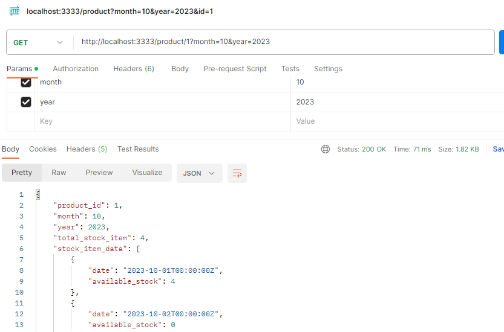

# rent-product

## Description

This is a simple backend service that is useful to check stock item availability of product for each date over a month. It is built using Go and can be run locally for development and testing purposes.

## Constraint

- Currently, only an API to retrieve stock availability for each date has been developed.
- Validation has not been implemented at this stage.
- Login/logout authentication has not been implemented.
- Complete CRUD APIs for all entities have not been developed yet.

## Table of Contents

- [Prerequisites](#prerequisites)
- [Installation](#installation)

## Prerequisites

Before you begin, ensure you have met the following requirements:

- Go (Golang): [Installation instructions](https://golang.org/doc/install)
- PostgreSQL: [Installation instructions](https://www.postgresql.org/download/)

## API

```
curl --location 'http://localhost:3333/product/1?month=10&year=2023'
```

```
URL Param
- productID
Query Param
- month : selected month
- year :selected year
```

The following screenshots show you how to test the APIs using Postman.



## Installation

To set up this project locally, follow these steps:

- Clone the repository
- Run command `go mod tidy`
- Create database by following [this configuration](../rent-product/files/rent-product.json)
- Create table and data using [this query](../rent-product/initdb/init.sql)
- Run command `go run main.go`
- If you have docker installed on your computer, you just need to run this command : `docker-compose up`

The application will start on the default port 3333.